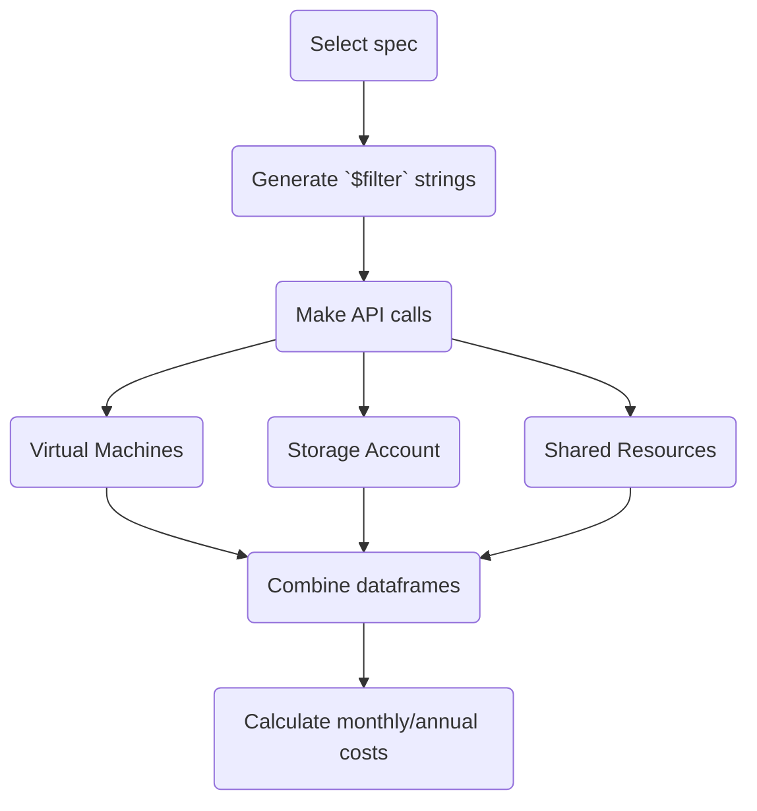

# Cost Estimates for defined Azure architecture
Effort to utilise [Azure Retail Prices REST API](https://learn.microsoft.com/en-us/rest/api/cost-management/retail-prices/azure-retail-prices) to fetch cost estimates for TREs.  

Plan is to programmatically generate `$filter` strings that can be passed to getPrices method and fetch prices from API.  

Ultimately users will be able to choose VM size(s) and quantity along with storage volume and receive a monthly/annual cost estimate for a TRE of that specification.  

Costs of additional resources required for a functional TRE will be included, defined in a separate file (*.json?).  

Initially Type A TREs will be covered but should be extensible to include Type B & C eventually.  



## getPrices(queryString)
Method to fetch the results from Azure Retail Prices REST API.  
Takes a string variable as a url `$filter` and returns a dataframe containing result of an API call.  
Currency code (GBP) embedded in api url.  

## TRE Design
 
This should be applied to every `$filter` string query:
```
(armRegionName eq 'Global' or armRegionName eq 'uksouth')
```
The region `uksouth` is defined in `resources.json` and can be changed there if needed.  

Basic elements of a standard (Type A) TRE:  

### VMs
Each VM in a TRE requries the following:
|Resource|Identifed by|Example value|Additional parameters|
|---|---|---|---|
|Virtual Machine|`armSkuName`|'Standard_D16s_v4'|`and priceType eq 'Consumption'` <br> `and contains(meterName, 'Spot')` <br> `and contains(productName, 'Windows')`|
|Managed Disk|`metername`|'E10 LRS Disk'|
|Network Interface*|Unknown|Unknown|

*Appears there may be no non-negligable costs associated with Network Interface.  

### Storage Account
Each Storage Account (usually just the one) in a TRE requries the following:
|Resource|Identifed by|Example value|
|---|---|---|
|Storage Account|Multiple meterNames relating to various billable elements||
|Private Endpoint|`meterName`|'Standard Private Endpoint'|
|Network Interface*|unknown|unknown|

*Appears there may be no non-negligable costs associated with Network Interface.  

### Shared Resources
Resources needed for and shared across each TRE:  
|Resource|Identifed by|Example value|
|---|---|---|
|Disk Encryption Set|||
|Recovery Services vault|||
|Network security group|||

